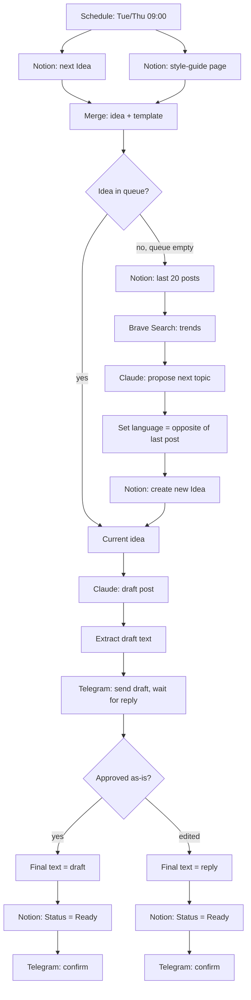

# LinkedIn Auto-Post (n8n)

An n8n workflow that runs my LinkedIn content pipeline end to end — from picking (or inventing) a topic, to drafting the post with Claude, to a human approval step in Telegram, to marking it ready in Notion. It has been running in production twice a week (Tue/Thu) since September 2026.

Built for [Automate-AI](https://automate-ai.pt) — this is the same pattern (schedule → LLM → human-in-the-loop → data store) I use for client automations, applied to my own content workflow.

## What it does

1. **Checks Notion for a queued idea.** A Notion database ("LinkedIn Content") holds post ideas with a `Status` field. The workflow pulls the oldest one still marked `Idea`.
2. **If the queue is empty, it invents the next topic itself.** It reads the last 20 published posts from Notion (so it doesn't repeat itself), pulls fresh context with a Brave Search, and asks Claude to propose a topic that fits one of four fixed content pillars.
3. **Language alternates deterministically, not by LLM guess.** Posts must alternate strictly between English and Portuguese. Instead of trusting the model to remember, the workflow reads the language of the most recent post from Notion and flips it in code (`lastLang.includes('EN') ? 'PT' : 'EN'`). The model never decides the language.
4. **Claude drafts the post**, using a style guide stored as a Notion page (fetched fresh every run, so editing the style guide in Notion changes future posts with no workflow redeploy).
5. **The draft goes to Telegram for approval** using n8n's `sendAndWait` — the workflow pauses until I reply. Replying "ok"/"да" accepts the draft as-is; any other text replaces it outright and is used as the final post.
6. **Notion is updated to `Ready`** with the final text, and Telegram gets a confirmation. Posting to LinkedIn itself is still a manual paste — deliberate, see [Notes](#notes--known-limitations).

## Flow

## Stack

- **n8n** — orchestration
- **Notion** — content queue + style guide (single source of truth, no hardcoded prompts in the workflow)
- **Claude** (`claude-sonnet-5`, via n8n's Anthropic node) — drafting + topic generation
- **Brave Search** — fresh context for auto-generated topics
- **Telegram** — human-in-the-loop approval (`sendAndWait`)

## Design decisions worth noting

- **Human approval is a hard gate, not a suggestion.** Nothing reaches `Ready` in Notion without an explicit Telegram reply. `sendAndWait` blocks the workflow run until that happens.
- **Language is enforced in code, not in the prompt.** Early versions asked Claude to alternate EN/PT itself — it drifted (including once producing Russian, since the surrounding automation context is in Russian). Language selection was moved out of the LLM entirely into a deterministic `Set` node.
- **Style guide lives in Notion, not in the workflow.** The system prompt for the drafting step is fetched from a Notion page on every run — I can retune tone/voice without touching n8n.
- **The queue self-refills.** If there's no queued idea, the workflow doesn't fail or wait for me — it researches and proposes the next topic itself, avoiding repeats by checking recent history first.
- **LinkedIn posting is intentionally still manual.** LinkedIn's API requires a Company Page to register a developer app, and Company Page creation has an (undocumented) minimum-connections requirement I haven't cleared yet. Manual paste is the honest current state, not an oversight.

## Setup

This repo ships the exported workflow (`workflow.json`) with all personal identifiers stripped. To run it yourself:

1. Import `workflow.json` into n8n.
2. Create a Notion database with at least: `Status` (select: `Idea` / `Ready` / …), `Pillar` (select), `Language` (select), `Post Draft` (rich text), `Note` (rich text), plus a title property.
3. Create a Notion page with your style guide / voice guidelines as plain markdown.
4. Replace the placeholders in the workflow: `YOUR_NOTION_DATABASE_ID`, `YOUR_PROMPT_TEMPLATE_PAGE_ID`, `YOUR_TELEGRAM_CHAT_ID`.
5. Connect your own Notion, Telegram, and Anthropic credentials (n8n will prompt for these on import — none are included in the export).

## Notes / known limitations

- Posting to LinkedIn is manual by design right now (see above) — the workflow prepares the approved text, a human still pastes it in.
- The four content pillars and the exact Notion schema are specific to my content plan; swap them for your own categories.

---

Part of [Automate-AI](https://automate-ai.pt) — AI automation for SMEs in Portugal and beyond. Built on n8n + LLM APIs.
